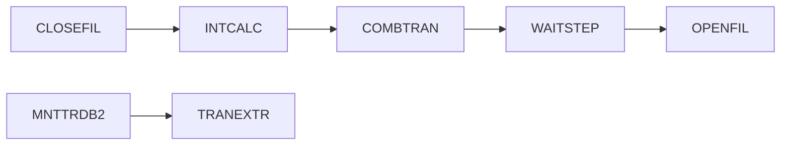

# Batch schedule graph

Source: `app/scheduler/CardDemo.controlm`

```mermaid
flowchart LR
  INTCALC --> COMBTRAN
  CLOSEFIL --> INTCALC
  WAITSTEP --> OPENFIL
  MNTTRDB2 --> TRANEXTR
  COMBTRAN --> WAITSTEP
```

In scope: INTCALC, POSTTRAN, READACCT, READCARD, TRANREPT
